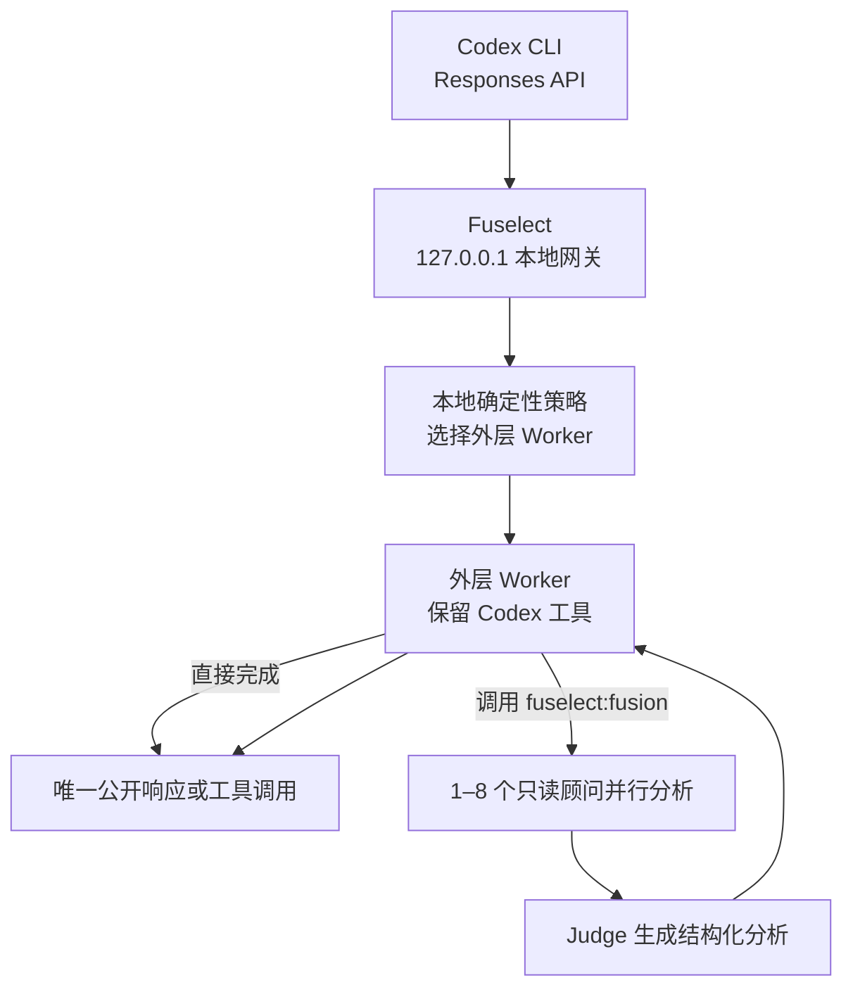

# Fuselect

面向 Codex CLI 的本地、隐私优先、多模型 Fusion 网关。

Fuselect 计划在本机提供一个经过认证的 OpenAI-compatible 入口，让一个外层编码模型根据任务需要调用受限的多模型评议流程：多个只读顾问并行分析，一个 Judge 汇总共识、分歧与遗漏，最后仍由原来的外层模型生成唯一的最终回答或 Codex 工具调用。

> [!WARNING]
> Fuselect 目前处于早期开发阶段，还不是可用于真实编码流量的完整网关。仓库已经具备 Rust CLI、配置领域模型、SQLite 元数据存储和系统密钥库边界；协议网关、完整 Fusion 执行、Codex 自动配置和 TUI 仍在后续里程碑中。

Fuselect 是独立开源项目，不隶属于 OpenRouter，也不承诺与 OpenRouter Fusion 的内部实现完全一致。项目目标是实现其对用户有价值的核心结果：按需引入多个模型的独立分析，同时保持 Coding Agent 工具循环只有一个执行者。

## 为什么做 Fuselect

Coding Agent 的不同请求对模型能力要求差异很大。简单修改不一定需要最昂贵的模型，复杂调试、长上下文理解和高风险重构又可能受益于多个模型的交叉检查。

Fuselect 的目标是：

- 为 Codex 提供一个固定的本地模型入口，无需为每个任务手动切换 Provider。
- 普通请求由单个外层 Worker 直接完成，避免不必要的多模型开销。
- 复杂请求由外层 Worker 按需调用 Fusion，而不是只在失败后更换模型。
- 在质量优先的前提下，通过本地确定性策略、预算上限和评估数据控制成本。
- 不让顾问或 Judge 获得 Codex 工具，避免重复改文件、重复执行命令或产生冲突。
- API Key 永远留在本机系统密钥库，SQLite 和日志只保存非敏感元数据。

Fusion 不保证每次都降低费用。一次 Fusion 会产生多个上游调用，单次成本通常高于直接调用。Fuselect 只有在“减少不必要的强模型调用”和“提高一次解决成功率”带来的收益大于 Fusion 开销时，才可能降低总体成本。默认策略是否真正省钱，必须通过版本化评估集证明，而不是只凭模型价格推断。

## 工作原理



核心约束：

1. Codex 请求公开虚拟模型 `fuselect/auto` 或 `fuselect/fusion`。
2. Fuselect 使用本地质量优先、成本次优策略选择外层 Worker，不调用另一个云端“路由模型”。
3. `fuselect/auto` 允许外层 Worker 自行判断是否调用内部工具 `fuselect:fusion`。
4. `fuselect/fusion` 强制本轮调用该内部工具。
5. 顾问并行分析同一份上下文，但看不到 Codex 的真实工具。
6. Judge 输出结构化的共识、矛盾、覆盖缺口、独有洞见、盲点和执行建议。
7. Judge 结果作为内部工具结果返回同一个外层 Worker。
8. 只有外层 Worker 可以生成最终文本或调用 Codex 工具。
9. 内部 Fusion 调用、顾问输出和 Judge 原文不会出现在返回给 Codex 的公开流中。
10. 每轮最多执行一次 Fusion，禁止嵌套或无限递归。

## 与 Codex 的协议边界

Codex 通过 OpenAI Responses API 访问 Fuselect。Fuselect 将请求转换为统一内部格式，再调用已验证的 OpenAI Chat Completions Worker。

计划提供的本地接口：

| 接口 | 用途 |
| --- | --- |
| `GET /health/live` | 本机存活检查 |
| `GET /health/ready` | 经过认证的就绪检查 |
| `GET /v1/models` | 返回 Fuselect 虚拟模型 |
| `POST /v1/responses` | Codex 主要入口 |
| `POST /v1/responses/compact` | Codex 会话压缩 |
| `POST /v1/chat/completions` | 未来其他 OpenAI-compatible 客户端入口 |

公开虚拟模型：

- `fuselect/auto`：默认启用 Fusion，但由外层 Worker 决定是否调用。
- `fuselect/fusion`：要求本轮执行 Fusion。

Fuselect 将显式处理 Responses/Chat Completions 的消息、工具、工具结果、SSE、`previous_response_id` 和压缩语义。不能安全转换的字段会返回明确错误，不会静默丢弃。

## Codex 接入方式

完整接入功能仍在规划中。目标使用流程是：

```powershell
fuselect init
fuselect worker add
fuselect fusion preset add
fuselect gateway start
fuselect codex setup
codex -p fuselect
```

`fuselect codex setup` 将：

- 先备份用户级 `~/.codex/config.toml`。
- 新增独立的 Fuselect Provider 和 Profile。
- 将 `wire_api` 明确设置为 `responses`。
- 指向 `http://127.0.0.1:8787/v1`。
- 使用绝对路径调用 `fuselect gateway-token` 获取 Gateway Key。
- 保留原有默认 OpenAI Provider，不覆盖用户现有设置。
- 支持通过备份 ID 回滚配置。

Gateway Key 不会写进 Codex TOML。`gateway-token` 的设计输出是严格的一行密钥，诊断信息只写入 stderr。

## Worker 准入

第一版最多配置 10 个 Worker。每个 Worker 必须通过兼容性探测，证明支持：

- OpenAI Chat Completions 请求格式。
- SSE 流式输出。
- 普通 function tools。
- 流式工具参数。
- 项目要求的超时、错误和 usage 行为。

内置能力标签：

| 标签 | 含义 |
| --- | --- |
| `coding` | 代码实现与重构 |
| `reasoning` | 复杂分析与规划 |
| `review` | 代码审查 |
| `debug` | 调试与故障定位 |
| `long_context` | 长上下文任务 |
| `tools` | 工具调用 |
| `fast` | 低延迟 |
| `low_cost` | 低成本 |

不符合基础协议要求的模型不会被启用。Provider 差异通过版本化、声明式 compatibility profile 处理，不允许执行任意用户脚本来转换协议。

## Fusion 配置

Fusion 可以通过命名预设或请求级覆盖配置：

- `enabled`
- `force`
- `preset`
- `analysis_models`
- `judge_model`
- `max_completion_tokens`
- `reasoning`
- `temperature`

规划中的默认策略：

- `coding-budget`：优先控制成本，在适合的任务上使用较小顾问面板。
- `coding-high`：优先提高复杂编码任务的分析覆盖率。

一个有效 Fusion 由以下角色构成：

- 1–8 个顾问 Worker。
- 1 个与顾问角色不重叠的 Judge Worker。
- 1 个保留原始 Codex 工具的外层 Worker。

显式请求配置优先于命名预设。所有 Worker ID、角色唯一性、能力、上下文窗口、最大输出 Token 和预算都会在发起网络请求前验证。

## 成本与预算

Worker 价格使用每百万 Token 的整数微美元保存：

- 输入价格
- 输出价格
- 可选缓存输入价格

Fuselect 计划同时执行每任务和 UTC 每日硬预算：

1. 在外层首次调用、顾问面板、Judge 和外层继续调用前预留最坏情况成本。
2. 预留必须包含配置的最大输出 Token；没有安全上限时拒绝执行。
3. 请求完成后根据 Provider 返回的 `usage` 结算。
4. Provider 不返回 usage 时标记为 `cost_unknown`，不会伪造为零成本。
5. 崩溃后遗留的预算预留会在再次接收请求前进行恢复处理。

后续 `fuselect eval` 会比较直接 Worker、`coding-budget` 和 `coding-high` 的任务成功率、延迟、Fusion 启用率、已知成本和每次成功成本。

## 隐私与安全边界

| 数据 | 保存位置 | 默认持久化 |
| --- | --- | --- |
| Worker API Key | Windows Credential Manager / Linux Secret Service | 是，仅系统密钥库 |
| Gateway Key | 系统密钥库 | 是 |
| Worker 配置、价格、能力 | 本机 SQLite | 是 |
| 路由、阶段、Token、成本、延迟、结果 | 本机 SQLite | 是，仅元数据 |
| Prompt、代码、模型回答 | 请求内存 | 否 |
| 工具参数与工具结果 | 请求内存 | 否 |
| 顾问和 Judge 输出 | 请求内存 | 否 |
| Codex 会话正文 | 有界内存 | 默认不持久化 |

安全原则：

- 网关只绑定 `127.0.0.1`，不对局域网公开。
- 每个 API 请求必须携带 Gateway Key。
- Authorization Header、API Key 和请求正文不得进入日志。
- Advisors 和 Judge 永远不能调用 Codex 工具。
- 内部工具名 `fuselect__fusion` 保留给网关，调用者不能覆盖。
- 内部 Fusion 工具调用不会透传给 Codex。
- 公开输出开始后不再重试可能重复工具调用的上游请求。
- Fuselect 默认不发送遥测、分析数据或崩溃报告。
- 绑定非 loopback 地址、远程同步或云端密钥存储都需要新的威胁模型审查。

系统密钥库可以保护密钥不被普通配置文件意外泄漏，但无法完全防御已经控制同一用户账户的恶意软件。

## CLI 与 TUI

规划中的命令面：

```text
fuselect init
fuselect worker add|list|show|remove|test
fuselect fusion preset add|list|show|remove
fuselect gateway start|rotate-key
fuselect gateway-token
fuselect codex setup|status|rollback
fuselect status
fuselect logs list
fuselect doctor
fuselect privacy
fuselect config validate|export
fuselect backup create|list|restore
fuselect tui
```

交互规则：

- 中文优先的人类可读输出。
- `--json` 为成功结果和应用层错误提供稳定、无 ANSI 的机器可读对象；命令拼写或参数类型错误由 Clap 在应用启动前输出为无 ANSI 的普通 stderr。
- TTY 缺少参数时使用向导；非交互环境永不等待输入。
- API Key 使用隐藏输入，不接受可能进入 Shell 历史的明文参数。
- 删除、网络探测和配置回滚需要确认；自动化环境使用 `--yes`。
- 退出码 `2` 表示配置错误，`3` 表示密钥或认证错误，`4` 表示健康检查失败，`5` 表示预算拒绝，`6` 表示上游或 Fusion 执行失败。

可选 TUI 将使用 Ratatui + Crossterm，支持 Windows 和 Linux 终端，并复用与 CLI 相同的应用服务：

- Overview：网关、预算和最近运行状态。
- Workers：添加、测试、启用和删除 Worker。
- Fusion：配置顾问、Judge、预算和预设。
- Runs：只显示元数据的运行阶段、延迟、Token 和成本。
- Codex：查看 Profile、执行安全配置与回滚。

TUI 不提供独立聊天页。编码任务仍然在 Codex 中完成。

## 当前开发状态

| 能力 | 状态 |
| --- | --- |
| Rust 2024 CLI 与 Apache-2.0 工程基线 | 已完成 |
| Windows/Ubuntu 格式化、Clippy、测试 CI | 已完成 |
| Worker、预算、Fusion 领域模型与校验 | 已完成 |
| SQLite 迁移和非敏感元数据存储 | 已完成 |
| OS Keyring 抽象与测试用 FakeSecretStore | 已完成 |
| `init`、Worker、Fusion preset 本地配置 CLI | 开发与验收中 |
| Worker 网络兼容性探测 | 未实现 |
| Responses/Chat Completions 统一协议层 | 未实现 |
| 本机认证 Gateway | 未实现 |
| 预算执行与运行日志 | 未实现 |
| 外层 Worker 与 Fusion 工具循环 | 未实现 |
| Codex Profile 自动配置 | 未实现 |
| 多轮会话与 compaction | 未实现 |
| TUI、后台服务与正式发布包 | 未实现 |

当前仓库不能用于生产流量，也不应被描述为 OpenRouter Fusion 的可用替代品。

## 路线图

| 里程碑 | 范围 | 完成证据 | 发布定位 |
| --- | --- | --- | --- |
| M0 — Foundation | 工程、配置、存储、协议和认证网关 | 本机认证网关接收有效请求，SQLite 中没有密钥 | 内部原型 |
| M1 — Correct Coding/Fusion Path | 预算、Worker 流、Fusion、Codex、多轮状态和 E2E | Codex 直接与 Fusion 工具循环、续轮和压缩测试通过 | 私有 Alpha |
| M2 — Daily Local Operation | TUI、恢复、生命周期、健康和用户级服务 | Windows x64 与 Linux ARM64 日常操作验证通过 | Beta |
| M3 — Trustworthy Public Project | 安全、评估、文档、兼容性和发布证据 | 安全门禁、评估、SBOM、签名与发布矩阵通过 | Stable |

完整的 23 项实施计划、逐任务测试和验收条件见：

[Fuselect CLI Implementation Plan](2026-07-23-fuselect-cli-plan.md)

## 从源码参与开发

### 环境要求

- Rust stable，MSRV 1.85。
- Windows：Rust MSVC 工具链，以及包含“使用 C++ 的桌面开发”工作负载的 Visual Studio Build Tools。
- Linux：目标平台所需的标准 C/C++ 构建工具链。

### 本地验证

```powershell
cargo fmt --check
cargo clippy --all-targets -- -D warnings
cargo test --all-targets
```

构建当前开发二进制：

```powershell
cargo build
.\target\debug\fuselect.exe --help
```

Linux：

```bash
cargo build
./target/debug/fuselect --help
```

测试和开发时应设置临时 `FUSELECT_HOME`，避免触及真实用户配置：

```powershell
$env:FUSELECT_HOME = Join-Path $env:TEMP "fuselect-dev"
cargo test --all-targets
```

不要在 Issue、测试夹具、日志或提交中包含真实 API Key、Gateway Key、Prompt、源代码或 Provider 响应。

## 目标平台与发布物

首批计划发布：

- `fuselect-windows-x86_64.zip`
- `fuselect-linux-aarch64.tar.gz`

正式发布将同时提供 SHA-256 校验、SBOM、签名来源证明和包含源码版本、Rust 版本、兼容性矩阵及测试证据的机器可读发布清单。

## v1 非目标

- 原生桌面图形界面。
- 远程同步配置或在云端保存 API Key。
- 通过 `/v1/models` 自动发现 Provider 模型。
- 训练本地 Router 或持久化原始 Trace-to-Train 数据。
- 支持未经验证的非 OpenAI Chat Completions 上游协议。
- 让顾问或 Judge 调用 Codex 工具。
- 在第一版为顾问/Judge 提供网页搜索或抓取。
- 嵌套或无上限 Fusion。

## 稳定版标准

Fuselect 只有在以下证据全部具备后才会标记为 Stable：

- Windows x64 与 Linux ARM64 的完整 Codex、Gateway、Fusion 和恢复流程通过。
- Responses、Chat Completions、工具流、多轮状态和 compaction 兼容性测试通过。
- 取消、并发限制、熔断、优雅关闭及公开输出后禁止重试的测试通过。
- 预算能在发送超额请求前阻止调用。
- SQLite、日志、备份和 TUI 中不存在原始代码、Prompt、工具内容或密钥。
- `cargo audit`、`cargo deny`、模糊测试、SBOM 和供应链来源证明通过。
- 离线评估证明默认预设没有降低协议/工具正确性，并提供真实的质量—成本依据。
- 发布工作流生成经过验证的二进制、校验和、兼容矩阵和回滚说明。

## License

Fuselect 使用 [Apache License 2.0](LICENSE)。
